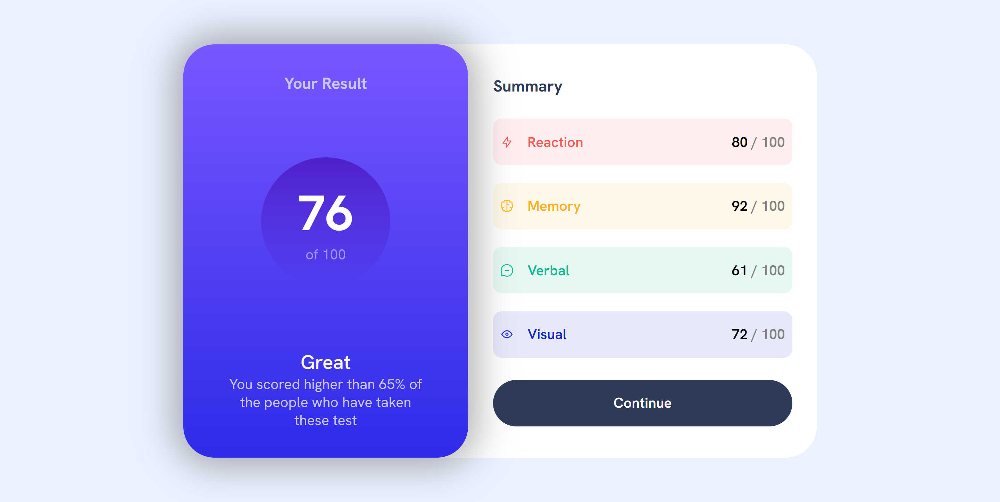

# Frontend Mentor - Results summary component solution

This is a solution to the [Results summary component challenge on Frontend Mentor](https://www.frontendmentor.io/challenges/results-summary-component-CE_K6s0maV). Frontend Mentor challenges help you improve your coding skills by building realistic projects. 

## Table of contents

- [Overview](#overview)
  - [The challenge](#the-challenge)
  - [Screenshot](#screenshot)
  - [Links](#links)
  - [Built with](#built-with)
  - [What I learned](#what-i-learned)
  - [Continued development](#continued-development)
  - [Useful resources](#useful-resources)
- [Author](#author)

## Overview

### The challenge

Users should be able to:

- View the optimal layout for the interface depending on their device's screen size
- See hover and focus states for all interactive elements on the page
- **Bonus**: Use the local JS data in the script.js file to dynamically populate the content

### Screenshot

 
### Links

- Solution URL: [Add solution URL here](https://your-solution-url.com)
- Live Site URL: [Add live site URL here](https://isaac-7it.github.io/Result-Summary-Component/)

### Built with

- Semantic HTML5 markup
- CSS custom properties
- Flexbox
- CSS Grid
- Mobile-first workflow

### What I learned

I was able to refresh my knowledge (after a long time 😅) on JavaScript DOM, CSS Selector and CSS Layout

I realized that for the below code snippet to work, the elements needs to be elements of the same parent

```html
 <div class="summary__rating"><span class="summary__quality">
            <span class="props"><!--Fetched by JS--></span></span><span><span class="score"><!--Fetched by JS--></span>
            <span class="ovr">/ 100</span></span></div>
        <div class="summary__rating"><span class="summary__quality">
            
            <span class="props"><!--Fetched by JS--></span></span><span><span class="score"></span><!--Fetched by JS-->
            <span class="ovr">/ 100</span></span></div>
        <div class="summary__rating"><span class="summary__quality">
            
            <span class="props"><!--Fetched by JS--></span> </span><span><span class="score"></span><!--Fetched by JS-->
            <span class="ovr">/ 100</span></span></div>
```
```css
.props:nth-of-type(n) {}
```
Also, I'm proud of my JS code 😅🎉. Never belived that I could still remember JS

```js
const proudOfThisFunc = () => {
  console.log('🎉')
}
```

### Continued development

I want to still work on the layout aspect of the site and remove excess spacings

### Useful resources

- [Example resource 1](https://github.com/features/copilot) - This helped me when I had the selector issue


## Author

- Website - [Isaac Aladegbehingbe](https://isaac-7it.github.io/Portfolio/)
- Frontend Mentor - [@Isaac-7it](https://www.frontendmentor.io/profile/Isaac-7it)
- Twitter - [@Isaactweet7](https://x.com/Isaactweet7)